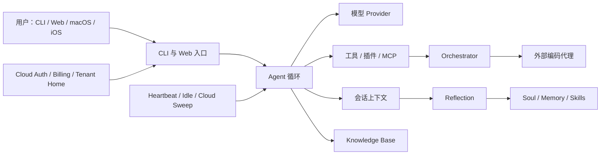
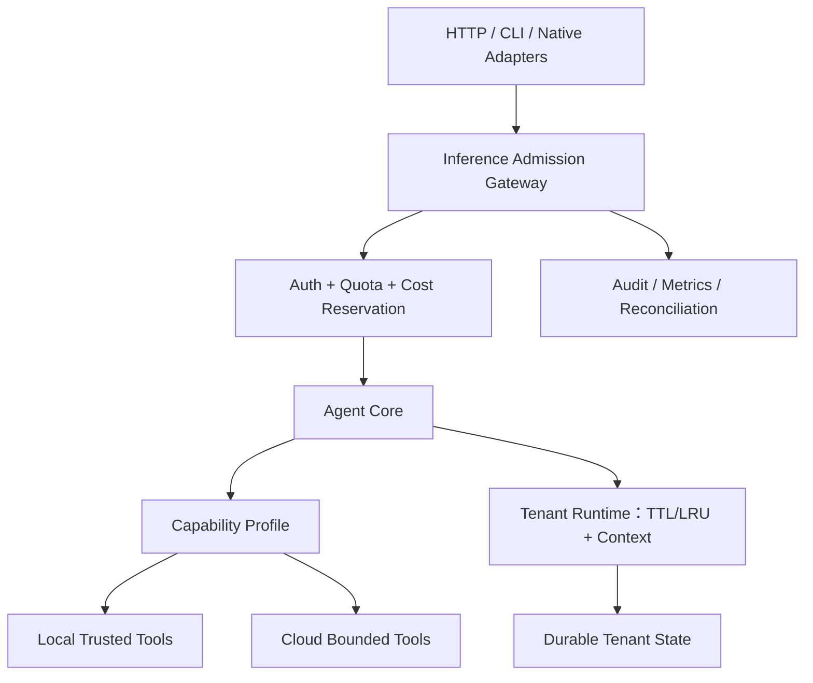

# 架构认知

## 运行时总图

## 组装路径

`src/cli.ts` 是组合根：

1. 解析 CLI 与环境配置。
2. 创建模型 Provider。
3. 创建内建工具。
4. 合并批准的技能、插件与 MCP 工具。
5. 载入会话、Soul、知识库和反思机制。
6. 启动 REPL 或把组合后的能力交给 Web 服务。

这一设计让本地功能组合灵活，但也意味着 Web/Cloud 会继承 CLI 的完整工具集合。Cloud 安全边界应在组合阶段和服务器路由阶段双重建立。

## Agent 循环

`src/agent.ts` 的核心职责：

- 调用统一 Provider 接口并流式输出；
- 接收模型的 tool call；
- 校验工具名与参数；
- 经过审批与 Hook；
- 执行工具并把结果放回上下文；
- 受最多 32 次迭代、Token 预算、终止信号和异议机制约束；
- 支持 Prompt 热更新。

Prompt 由 Soul、技能、记忆和知识库共同组成。Agent 本身是核心能力边界，所有 Web、自治与外部表面最终都应通过一致的推理准入与审计层调用它。

## Soul 与 Reflection

Soul 位于动态 `lisaHome()` 下，包含：

- identity / purpose / constitution
- emotions / values / opinions / desires
- journal / relationships
- memory / skills

Soul 写入具备文件锁、原子写入、审计和 Git 溯源等防护。Reflection 从会话中提取结构化操作，更新日志、记忆、技能、情绪、观点和欲望，并对格式错误进行重试。

关键风险不是“是否能写”，而是“同一段会话是否会被重复反思”。Cloud sweep 当前更接近按时间扫描，而不是按消息水位和幂等键消费。

## Knowledge Base

知识库大致有三层：

1. 原始来源与摄取适配器；
2. Wiki / Schema 与链接图；
3. TF-IDF 检索与 Git 版本管理。

知识库输入会进入 Prompt，必须继续把外部内容视为不可信数据，而不是指令。路径限制、来源元数据、注入防护和可追溯性是它的核心安全属性。

## 自治机制

自治分为不同信任级别：

- 自动 Heartbeat / Idle：使用受限工具集；
- 用户编写的定时 Heartbeat：可以使用完整工具；
- Cloud autonomy sweep：遍历账户并对最近会话做反思。

后续设计应明确记录每次自治行为的触发者、能力配置、预算、会话水位、幂等键和结果，而不是只依赖“是哪条代码路径”推断权限。

## Orchestrator

编排器观察 Claude、Codex、OpenCode、Aider、GitHub 等来源，把状态规范化后用于建议、展示和调度。它支持受管代理与 PTY 代理。

这是 LISA 的差异化能力之一，也是一条高权限路径。Cloud 中不得让租户直接继承宿主机进程、任意工作目录或运营方 MCP/插件能力。

## Web 与 Cloud

Web 服务同时承担：

- 静态 UI 与客户端脚本；
- REST 与 SSE；
- 对话；
- 认证、邮箱验证和账户；
- 套餐、额度、IAP；
- Soul、计划、知识库和反思接口；
- 外部代理控制；
- 自治调度。

`AsyncLocalStorage` 将请求映射到用户专属 Lisa Home，SSE 事件也有租户过滤，这是正确基础。但进程级缓存、最近活动、Advisor 状态和部分配置仍是全局的，说明租户边界尚未完成。

## 持久化

当前同时使用：

- 本地文件与原子写入；
- Git；
- 可选对象存储；
- 可选 Firestore；
- 进程内缓存。

合适的目标不是把所有内容塞入一个数据库：

- 本地版继续使用文件和 Git，保留可检查、可迁移、用户拥有的特性；
- Cloud 的账户、认证、余额、交易与租约必须使用支持事务和唯一约束的权威存储；
- Soul 大对象可以保留为对象存储或版本化文档，但要有 schema version 和迁移。

## 跨端 API 契约

- `contracts/lisa-api-v1.openapi.json` 是 TypeScript 服务端与 iOS 客户端共享的
  OpenAPI 3.1 源；生成常量不得手改。
- `/api/*`、`/chat`、`/events` 响应携带 `X-Lisa-API-Version`。v1 保持现有 body
  兼容，允许新增可选字段和未知 SSE 事件。
- Lisa Pocket 容忍无版本头的旧服务和同主版本新增字段，但拒绝更高主版本。
- `src/web/api-contract.test.ts` 用实际 DTO builder 与代表性 fixture 做 schema
  验证；破坏性协议变更必须升主版本或增加版本路由。

## 建议的目标边界

建议保持模块化单体，先建立明确边界，再决定是否需要拆服务。
