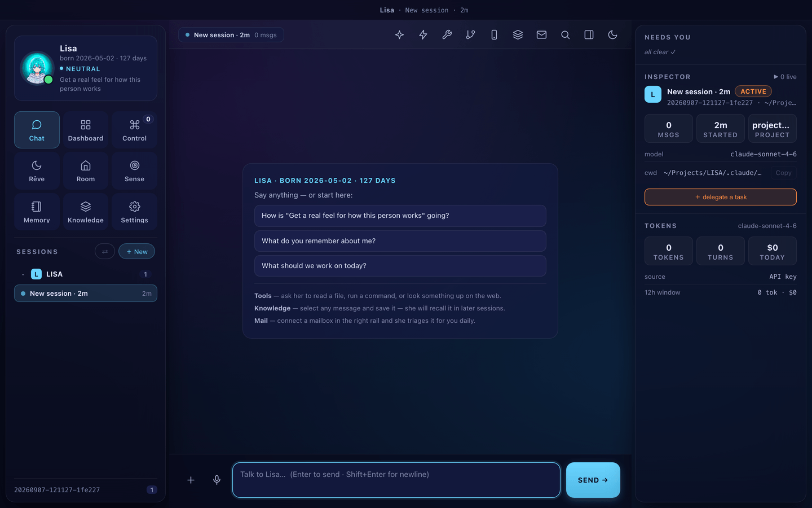
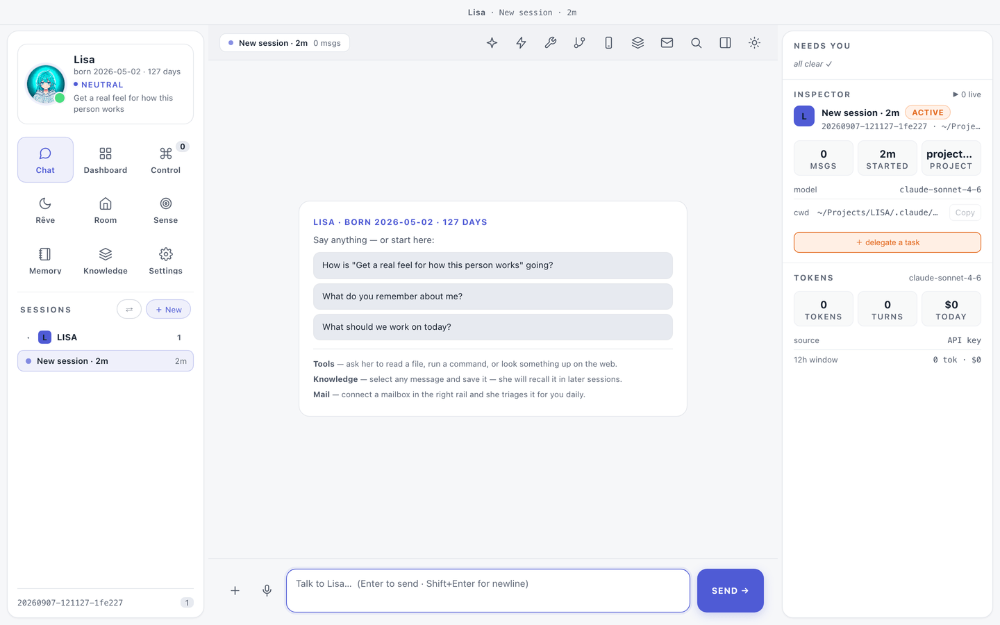

# LISA

[](https://www.npmjs.com/package/@oratis/lisa)
[](https://github.com/oratis/homebrew-tap)
[](https://github.com/oratis/LISA/releases/latest)
[](./LICENSE)
[](https://github.com/oratis/LISA/stargazers)
[](https://github.com/oratis/LISA/discussions)

> [English](./README.md) ｜ 中文

**开源 AI Personal Assistant（个人 AI 助手），帮助你规划、写作和整理个人知识。** 用 Lisa 规划一天、起草消息、整理个人知识库，或在 Mac 上协调编程 agent。可以使用托管的 LISA Cloud 聊天，也可以自行运行、选择模型。

[官网](https://meetlisa.ai) · [使用指南](docs/GUIDE.zh-CN.md) · [最新版本](https://github.com/oratis/LISA/releases/latest) · [路线图](docs/PLAN_ALWAYS_ON_UPGRADE_2026-09-30.md)

## 选择 Lisa 的运行位置

| 入口 | 能力 | 使用条件 |
| --- | --- | --- |
| **Mac app** | Web 工作区、菜单栏灵动岛、本地工具和 agent 控制 | 从 Releases 下载已签名、公证的 **Lisa-Suite.dmg**，内置 Node 与后端 |
| **CLI / 自托管 Web** | 本地助手、自选模型、知识库、集成与开发工具 | Node **22.19+**，以及供应商密钥或本地模型 |
| **LISA Cloud** | 账号聊天、记忆和知识工具，无需配置 Mac | [登录](https://meetlisa.ai/cloud/)，使用额度与可选充值适用 |
| **Lisa Pocket（iOS）** | 云聊天或连接可达的 Mac，分别保存两套连接 | 已重新提交 App Store 审核，**尚未获准公开上架** |

Cloud 与 Mac 是**两个独立实例**，不会自动同步聊天、记忆和凭据。本地工具要求 Mac 开机且网络可达；云端不开放你 Mac 的 shell、邮箱、编程 agent 或主机级推送服务。

<a id="install"></a>

## 快速开始

Mac 用户可从[最新版本](https://github.com/oratis/LISA/releases/latest)下载 **Lisa-Suite.dmg**。安装 CLI 时任选一种方式：

```sh
brew install oratis/tap/lisa
# 或
npm install -g @oratis/lisa
```

配置模型，然后启动：

```sh
mkdir -p ~/.lisa
# 将自己的密钥写入 ~/.lisa/config.env，例如：
# ANTHROPIC_API_KEY=your-key

lisa                    # 终端聊天；首次启动创建 Lisa 的身份
lisa serve --web        # Web 工作区：http://localhost:5757
```

支持 Anthropic、OpenAI、Gemini、OpenAI 兼容服务与本地模型。密钥、模型选择和 Ollama / LM Studio 配置见[供应商指南](docs/PROVIDERS.md)。编程任务也可通过[编程订阅](docs/GUIDE.md#coding-plans--use-a-subscription-instead-of-an-api-key)使用已支持的厂商 CLI。

## 你可以做什么

- **从日常任务开始。** 规划、写作和想法入口先生成可编辑草稿；聊天支持流式回复、工具活动、历史、取消与重试。
- **积累长期上下文。** 同一实例中的身份、记忆、观点和日记以文件保存，跨会话延续；回顾与反思可以更新愿望和技能。
- **维护个人知识库。** 保存链接，导入受支持的文章与视频字幕，检索带链接的 wiki，并从已配置的信息源生成简报。
- **协调编程 agent。** 观察支持的 Claude Code、Codex、OpenCode、Aider 会话，派发任务、对比 worktree，并审批 LISA-managed agent 的动作。具体控制取决于集成与本地配置。
- **连接本地工作流。** 可配置只读邮件、MCP、skills、插件，以及 Telegram / Discord / Slack / 飞书 / iMessage / webhook 渠道；登录云账号不会自动连接这些服务。
- **给 Lisa 独立工作时间。** 当前 `main` 新增持久目标、例程与本地 watcher，支持保存运行记录、取消和恢复。聊天创建的任务默认关闭，需要你启用；托管任务默认关闭，未接入审批的任务副作用会被拒绝。
- **看见她的状态。** 像素房间、情绪立绘与 Mac 灵动岛反映实际活动；手机小组件和 Live Activity 依赖已配置、可达的 Mac 与通知设置。

## 记忆、身份与控制

**SOUL** 是保存身份、目的、宪法与价值观的文件；**DESIRES** 引导自主工作；**HEARTBEAT** 与 **REVE** 提供定时执行与反思。这些是维持行为连续性的软件机制，不是对意识的宣称。

本地数据默认放在 `~/.lisa`。选择远程模型时，相关上下文会发给供应商；本地存储不等于纯本地推理。Lisa Pocket 在 AI 聊天前披露接收方，并支持撤回同意。参见[隐私政策](https://meetlisa.ai/zh-CN/privacy/)与[安全政策](docs/THREAT_MODEL.md)。

当前 `main` 中的 **Warden** 提供确定性动作决策、范围授权、审批收件箱与审计记录，需要在 **Web 聊天中主动启用**：

```sh
# Warden 自 v0.28.1 起随发布版提供。
lisa serve --web --approval warden
lisa approvals list
```

Warden 尚未覆盖全部执行入口，也不能替代操作系统沙箱。凭据句柄和入站邮件过滤是进一步的基础能力，不代表云连接器平台已经完成。参见[设计与限制](docs/DESIGN_WARDEN.md)、[威胁模型](docs/THREAT_MODEL.md)。

已合并的**主动消息规则**为接入的消息来源统一处理来源开关、免打扰时段、去重和预算。审批与严重告警有特殊投递规则；云端租户级 APNs 和跨设备中继仍待实现。参见[触达章程](docs/POLICY_REACH_OUT.md)。

## 开发状态

最新标签版本为 **v0.28.1**（[发布说明](docs/RELEASE_v0.28.1.md)），当前 `main` 可能包含后续开发。代码合并不代表已部署到 Cloud，或已包含在发布的原生安装包中。

| 工作方向 | 2026-10-07 状态 |
| --- | --- |
| 个人助手入口、Cloud/Mac 隔离、流式回复与历史修复 | 已合并；原生与生产验证见[执行记录](docs/EXECUTION_PERSONAL_ASSISTANT_2026-09-27.md) |
| Warden 核心 / 凭据代理 / 主动消息规则 | 已合并到 `main`；Web 聊天策略需要主动启用 |
| 持久目标、例程和 watcher | [PR #403](https://github.com/oratis/LISA/pull/403)，已合并；托管执行仍默认关闭 |
| 受保护的云端网页搜索与抓取 | [PR #404](https://github.com/oratis/LISA/pull/404)，已合并；默认关闭，生产未启用 |
| 按用途选择模型与成本控制 | [PR #407](https://github.com/oratis/LISA/pull/407)，已合并；估算预算为主动接入的 API，不是全局费用上限 |
| 跨设备记忆、租户级推送、日历/邮件写入连接器、电脑操作 | 规划中，不作为现有能力宣传 |
| iOS App Store | 消耗型额度恢复与 AI 告知已修复；10 月 7 日提交 **1.2 (1791346539)**，现为**等待审核**（[回执](docs/REVIEW_2026-10-07.md)） |

逐 PR 修复、验证与发布条件见[十月集成审查](docs/REVIEW_OPEN_PRS_2026-10-07.md)。

Muse 与其他 PA 产品的调研用于指导方向，实现边界见 [Muse 对照](docs/RESEARCH_MUSE_2026-09-27.md)、[全天候助手调研](docs/RESEARCH_ALWAYS_ON_AGENTS_2026-09-30.md)及[升级计划](docs/PLAN_ALWAYS_ON_UPGRADE_2026-09-30.md)。LISA 是独立项目。

<a id="截图"></a>

## 界面预览

<table>
<tr>
<td width="50%" align="center"><a href="assets/screenshots/shell-nebula.png"></a><br><b>Nebula 深色主题</b><br><sub>会话树、聊天、详情栏与实时情绪立绘。</sub></td>
<td width="50%" align="center"><a href="assets/screenshots/shell-calm.png"></a><br><b>Calm 浅色主题</b><br><sub>同一工作区，两种主题。</sub></td>
</tr>
</table>

[观看两分钟演示](https://www.youtube.com/watch?v=J_00iwAB_WI)

## 开发与贡献

```sh
git clone https://github.com/oratis/LISA.git
cd LISA
npm ci
npm run build
node dist/cli.js serve --web
```

提交修改前运行相关检查：

```sh
npm run typecheck
npm run typecheck:client
npm test
node scripts/check-md-links.mjs
node scripts/check-readme-drift.mjs
```

完整流程见[贡献指南](CONTRIBUTING.md)，原生构建说明见 [iOS](packaging/ios-companion/README.md) / [Mac](packaging/mac-client/README.md)。

## 更多资料

- [使用指南](docs/GUIDE.zh-CN.md)：安装、渠道、知识库、邮件、自主性、权限和工具。
- [文档索引](docs/README.md)：计划、调研、发布说明与运行手册。
- [更新日志](CHANGELOG.md) · [发布版本](https://github.com/oratis/LISA/releases)。
- [Issues](https://github.com/oratis/LISA/issues) 反馈问题 · [Discussions](https://github.com/oratis/LISA/discussions) 交流想法。

## 许可证

MIT，见 [LICENSE](LICENSE)。架构参考 pi-mono、OpenClaw、hermes-agent、Claude Code 和 Codex，见[致谢](docs/GUIDE.md#credits)。
