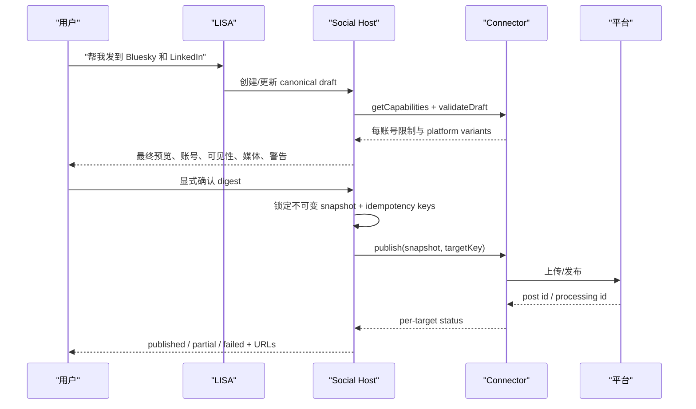
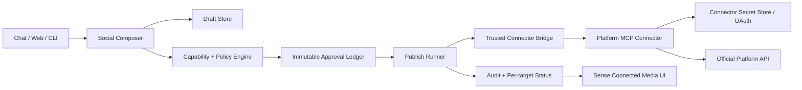

# PLAN · SENSE SOCIAL CONNECTORS — 对话式社交发布（v1.0）

> 调研与设计快照：2026-07-26  
> 状态：**方案锁定，S0 host foundation 已开始落地**  
> 关联：[PLAN_SENSE_v1.0.md](./PLAN_SENSE_v1.0.md)、[PLAN_SENSE_S2_v1.0.md](./PLAN_SENSE_S2_v1.0.md)、[PLAN_FOUNDATIONS_v1.0.md](./PLAN_FOUNDATIONS_v1.0.md)

---

## 0. 决策摘要

在 LISA 的 Sense 产品入口增加“Connected media”能力，让用户连接自己的社交账号，并通过对话准备、预览和发布文字、图片、视频与链接。

实现上采用三层：

1. **Connector**：MCP server，负责 OAuth、账号枚举、平台预检、媒体上传、发布与状态查询。
2. **Skill**：描述平台写作规则、最佳实践和工具调用顺序；不保存 token，不自行绕过 host。
3. **LISA Host**：负责跨平台草稿、能力协商、不可变确认、幂等、审计和 UI。

“连接账号”只授予能力，**不代表允许自动发布**。v1 每一次外部发布都必须由用户对最终快照进行明确确认。确认后如正文、目标账号、可见性、媒体或定时发生任何变化，确认立即失效。

虽然入口位于 Sense，但发布不是 `SenseSource`：

- `SenseSource` 是 consent-gated 的环境输入，输出 `SenseEvent`。
- 社交发布是会影响外部世界的 action，应落在独立的 `src/sense/social/` domain service。
- Sense UI/CLI 只作为“已连接能力、草稿、发布状态、撤销入口”的统一表面。

首发顺序建议：

1. **Bluesky + Mastodon**：开放、实现成本低，适合验证 host contract。
2. **Threads + LinkedIn**：覆盖文本/图片/视频/链接，账号和媒体流程更接近商业平台。
3. **X**：技术可行，但必须显式展示按量计费/余额失败。
4. **Instagram**：仅专业账号，媒体容器和公开 URL/上传流程更复杂。
5. **TikTok + YouTube**：视频链路长，且未审计应用存在私密发布限制；在异步任务、平台合规 UI 完成后再上。
6. **Facebook Pages**：只支持用户管理的 Page，不承诺向个人主页自动发帖。

不建议首发“一个万能 connector 直接适配所有平台”，也不建议 browser automation 代替官方 API。

---

## 1. 用户结果与范围

### 1.1 用户故事

- “把我的 Bluesky 和 LinkedIn 连上。”
- “帮我写一条介绍 LISA 0.22 的帖子，配这两张图，先给我预览。”
- “LinkedIn 更专业一点，Bluesky 更短；链接都用这个。”
- “发布。”→ LISA 展示最终平台化预览、目标账号、可见性和成本/限制 → 用户确认 → 执行。
- “YouTube 上传这个视频，先设为不公开。”→ 用户确认必填的 title、description、privacy、儿童内容/合成媒体声明等平台字段后上传。
- “刚才发得怎么样？”→ 查询异步处理结果与最终 URL；部分成功时明确列出每个平台状态。

### 1.2 v1 范围

- 连接/断开用户自己的账号。
- 枚举账号与运行时能力。
- 单平台及多平台草稿。
- 文字、HTTPS 链接、图片、视频。
- 平台化变体，而不是强行使用完全相同的正文。
- 媒体格式/大小/数量/alt text 预检。
- 显式发布确认、幂等执行、异步状态、部分成功报告。
- 本地审计，不持久化媒体原始字节。

### 1.3 非目标

- v1 不做无人值守自动发布、批量营销、自动评论/私信、删帖或改帖。
- 不用网页登录态、Cookie 或密码做 browser automation。
- 不承诺个人 Facebook 主页、普通 Instagram 消费者账号等官方 API 不允许的目标。
- 不把 connector 的 token、refresh token 或 client secret 注入 LLM 上下文、`SKILL.md`、`~/.lisa/mcp.json` 的明文 env。
- 不在 LISA host 重新实现每个平台 OAuth 和上传协议；这些属于 connector。
- 不把“定时”伪装成 host 睡眠后再发。平台原生 scheduling 不可用时，应使用可恢复队列，并在 UI 明确是“由 LISA 后台定时执行”。

---

## 2. 仓库现状与差距

| 层 | 已有能力 | 可复用点 | 缺口 |
|---|---|---|---|
| Sense | `SenseSource`、`SenseService`、事件日志、`lisa sense` | 统一产品入口与状态可见性 | 只有输入信号，没有外部 action domain |
| Consent | 默认全关、逐信号 grant/revoke、fail-closed | 环境采集继续沿用 | 社交发布不应误用 ambient consent；需要 account grant + per-publish approval |
| Skills | Markdown procedural skill；可选 `tool.js`，按 SHA 人工批准 | 平台写作与流程知识 | `tool.js` 同进程执行，权限过大，不适合作为首选社交 connector |
| Plugins | skills + `.mcp.json` + hooks | 打包一个平台 connector 与 skill | 没有 social connector manifest/capability contract |
| MCP | stdio server、工具自动进入 LISA toolset | 外部集成天然边界 | 当前只映射 name/description/schema，丢失 MCP tool annotations 和 structured media |
| Approval | CLI `ask-mutating`、managed-agent UI approval | 可复用交互模式 | 普通 Web chat 没有通用 tool approval；默认 CLI `auto` 也不能成为发布安全边界 |
| Multi-tenant | `lisaHome()`/`homeScope` | 草稿与审计可按用户隔离 | 全局插件与用户账号授权必须严格分离 |

结论：不能只“写一个 Skill 调 API”。必须先补 host-level contract 和确认状态机。

---

## 3. 外部平台调研

以下为 2026-07-26 的官方文档快照。平台版本、配额、审核与定价会变化，所以 connector 必须在运行时返回 capability，而不是把限制永久写死在 LISA。

### 3.1 能力矩阵

| 平台 | 可发布内容 | 账号/权限与关键约束 | 媒体流程 | v1 建议 |
|---|---|---|---|---|
| **Bluesky** | 文本、最多 4 张图片、链接卡、视频 | AT Protocol 账号；图片需 alt text，官方教程写明单图 2 MB；应上传前移除图片 metadata | 图片 `uploadBlob` 后写 `app.bsky.feed.post`；视频可 `uploadBlob`，官方推荐 video service 预处理后再发 | **Wave 1** |
| **Mastodon** | 文本、链接、图片、视频、音频、CW、可见性 | 每个实例限制可能不同，必须读 instance configuration；OAuth `write:media`/`write:statuses` | `POST /api/v2/media`，大媒体异步 202，再 `POST /api/v1/statuses` | **Wave 1** |
| **Threads** | 文本、链接、图片、视频、carousel | OAuth `threads_basic` + `threads_content_publish`；回复控制等字段需按账号能力展示 | 先创建 container，再 `/threads_publish`；图片/视频 URL 必须可被 Meta 拉取 | **Wave 2** |
| **LinkedIn** | organic 文本、图片、视频、文档、文章、multi-image、poll | 个人 `w_member_social`；组织需 `w_organization_social` 且用户有 Page role；API 必须带 `Linkedin-Version` | 图片/视频先上传取得 URN，再 `POST /rest/posts` | **Wave 2** |
| **X** | 文本、链接、图片、GIF、视频、poll 等 | 用户 OAuth；当前 API 按量计费，带 URL 的创建费用与普通创建不同，必须让用户可见 | `/2/media/upload` 后把 media id 传给 `/2/tweets` | **Wave 3** |
| **Instagram** | 图片、Reels、carousel；Stories 仅部分专业账号 | 仅 Professional（Business/Creator）；Instagram Login 使用 `instagram_business_content_publish`；Facebook Login 流程使用 `instagram_content_publish` 等权限 | media container → 查询处理 → `media_publish`；部分流程需公开可访问媒体 URL | **Wave 4** |
| **TikTok** | 视频、photo post；也可仅上传到 TikTok 草稿 | `video.publish`；未审计 client 的 Direct Post 只能 `SELF_ONLY`，还有活跃 creator/posting cap；必须让用户选择隐私和互动设置 | 视频可本地分块上传或 verified URL 拉取；图片使用 verified HTTPS URL；发布异步查询 | **Wave 5** |
| **YouTube** | 视频上传与 metadata；本方案不承诺 Community post | 最小 scope `youtube.upload`；未审计 API project 上传的视频被限制为 private；用户必须选择 public/private/unlisted | `videos.insert` 支持 resumable upload，处理状态异步；必须暴露 title/description/privacy 等必填 UI | **Wave 5** |
| **Facebook** | Page 的文字、链接、图片、视频/Reels | 只承诺用户管理的 Page，需 Page access token 与 `pages_manage_posts` 等权限；不承诺个人主页 | feed/photos/video 等不同端点，视频可恢复上传 | **Wave 6** |

### 3.2 对统一模型的直接影响

1. **平台能力不能只按 platform 判断**  
   TikTok 是否能公开、LinkedIn 能否发组织、Instagram 是否能发 Story、Mastodon 的媒体限制都与 app 审核、账号和实例有关。必须 `getCapabilities(accountId)`。

2. **链接不是一个简单字符串**  
   X 当前带 URL 的写调用计费不同；Threads 可有 link attachment；Bluesky 需要客户端抓取并构造卡片；Instagram 的 feed content 通常不是“纯链接贴”。统一 draft 保存 canonical URL，但 adapter 决定呈现。

3. **上传不是发布**  
   多数平台是“上传/创建 container → 处理 → 发布”。LISA 必须区分 `staging`、`processing`、`publishing`、`published`，并清理未使用的临时媒体。

4. **多平台不能做分布式原子事务**  
   A 成功、B 失败是正常状态。系统不能声称“全部回滚”；应输出 partial success，并支持只重试失败 target，沿用同一 idempotency key/target key。

5. **用户必须看到平台特有字段**  
   YouTube privacy、made-for-kids、synthetic media；TikTok privacy/comment/duet/stitch/commercial content；Mastodon visibility/CW；LinkedIn personal vs organization，不能被“通用发布按钮”隐藏。

---

## 4. 产品体验

### 4.1 连接

`Sense → Connected media → Add connector`

1. 选择已安装 connector plugin，或从可信目录安装。
2. LISA 展示 connector 的 publisher、版本、所需 scope、支持的平台和隐私说明。
3. 在系统浏览器完成 OAuth Authorization Code + PKCE。
4. Connector 返回账号句柄、显示名、头像（可选）、scope、token 过期状态；**不返回 token 给模型**。
5. 用户选择哪些账号在 LISA 中启用。
6. LISA 调用 `getCapabilities`，展示“能发什么、当前只能私密还是可公开、是否已通过平台审核”。

不支持 OAuth 的去中心化平台可采用平台颁发的 app password/token，但录入 UI 必须直接送入 connector secret store，不经过 chat。

### 4.2 对话到发布



### 4.3 确认卡必须包含

- 每个目标的 connector、平台、账号 display name/handle。
- 最终平台化正文，不只显示 canonical draft。
- 图片缩略图、视频名/大小/时长、每个媒体的 alt text。
- 链接最终 host（punycode/重定向风险提示）。
- 可见性、定时时间与时区。
- 平台特有声明与限制。
- 预计费用（若 connector 能提供）或“此平台按量计费”。
- “发布后无法由 LISA 原子撤回”的明确提示。
- 内容 digest 的短指纹。

“确认”绑定以下全部字段：

```text
targets + account ids + platform variants + visibility + schedule +
media sha256 + alt text + link + platform-specific declarations
```

任何字段变化 → revision +1 → 旧确认作废 → 重新预检与确认。

---

## 5. 架构



### 5.1 目录建议

```text
src/sense/social/
  types.ts             # canonical draft、target、status、capability
  manifest.ts          # trusted plugin social-connector.json 解析/发现
  drafts.ts            # revisioned draft + immutable approval snapshot
  policy.ts            # target capability intersection + required fields
  media.ts             # MIME sniff、sha256、metadata strip、staging policy
  runner.ts            # per-target state machine、retry/idempotency
  audit.ts             # append-only structural audit
  tool.ts              # 模型只可 compose/validate/request-confirmation
```

### 5.2 Connector plugin 结构

```text
~/.lisa/plugins/<connector>/
  .lisa-plugin/plugin.json
  .mcp.json
  social-connector.json
  skills/<platform>-publisher/SKILL.md
```

`SKILL.md` 只描述：

- 平台文风与字段含义。
- 何时调用 account/capability/validate 工具。
- 如何把 connector 的错误解释给用户。
- 必须先预览、等待 host confirmation。

它不得包含 token、client secret、refresh token，不得要求用 `bash/curl` 绕过 connector，不得把“用户说发布”当作跳过确认状态机的许可。

### 5.3 `social-connector.json` v1

```json
{
  "schemaVersion": 1,
  "id": "bluesky-official",
  "displayName": "Bluesky",
  "platform": "bluesky",
  "mcpServer": "bluesky",
  "skill": "bluesky-publisher",
  "tools": {
    "listAccounts": "social_accounts_list",
    "getCapabilities": "social_capabilities",
    "validateDraft": "social_draft_validate",
    "publish": "social_publish",
    "getPublishStatus": "social_publish_status",
    "disconnectAccount": "social_account_disconnect"
  }
}
```

本地 manifest 是 host 的**绑定 contract**；MCP annotations 是辅助信息，不是授权依据。原因是 MCP 规范明确说 annotations 只是 hint，非可信 server 可以撒谎。

### 5.4 Connector tool contract

#### `listAccounts`

只返回结构化账号句柄：

```ts
type SocialAccount = {
  id: string;
  platform: string;
  handle: string;
  displayName?: string;
  scopes: string[];
  authState: "connected" | "expired" | "revoked" | "needs-review";
};
```

#### `getCapabilities`

能力按 account 实时返回：

```ts
type SocialCapabilities = {
  content: {
    text: boolean;
    links: "none" | "inline" | "card";
    images: { supported: boolean; maxCount?: number };
    video: { supported: boolean; maxCount?: number };
  };
  visibilities: string[];
  scheduling: "none" | "native" | "host";
  publication: "public-capable" | "private-only" | "draft-only";
  requiredFields: string[];
  warnings: Array<{ code: string; message: string; blocking: boolean }>;
  observedAt: string;
};
```

#### `validateDraft`

- 只做预检，不发布。
- 返回每个字段的 blocking/warning。
- 返回 normalized preview 和可能的费用提示。
- 不允许借“预检”偷偷上传到用户公开账号。
- 如果平台只有在上传后才能最终校验，必须把该步骤标为 `stagingSideEffect`，放到确认之后。

#### `publish`

输入必须含：

- 已锁定 snapshot；
- host 生成的 `approvalDigest`；
- 每个 target 唯一 `idempotencyKey`；
- connector/platform/account；
- 结构化 media handle，不能是任意文件系统路径；
- 明确 visibility 与声明。

返回：

```ts
type PublishReceipt = {
  idempotencyKey: string;
  state: "processing" | "published" | "failed";
  remoteId?: string;
  url?: string;
  retryable?: boolean;
  error?: { code: string; message: string };
};
```

MCP annotations 最低要求：

| Tool | `readOnlyHint` | `destructiveHint` | `idempotentHint` | `openWorldHint` |
|---|---:|---:|---:|---:|
| listAccounts/getCapabilities/validateDraft | `true` | `false` | `true` | `true` |
| publish | `false` | `false`（additive） | `true`* | `true` |
| disconnect/delete | `false` | `true` | `true` | `true` |

\* 只有 connector 真的使用 host idempotency key 去重时才能标 true。

---

## 6. 数据与状态机

### 6.1 草稿

```ts
type SocialDraft = {
  id: string;
  revision: number;
  state:
    | "draft"
    | "awaiting-approval"
    | "approved"
    | "publishing"
    | "partial"
    | "published"
    | "failed"
    | "cancelled"
    | "expired";
  targets: SocialTarget[];
  canonical: {
    text?: string;
    link?: string;
    media: SocialMediaRef[];
    title?: string;
    description?: string;
  };
  variants: Record<string, PlatformVariant>;
  approval?: {
    digest: string;
    approvedAt: string;
    expiresAt: string;
  };
};
```

媒体只保存：

- 用户选择范围内的 host media id；
- MIME sniff 结果、bytes、sha256、尺寸/时长；
- alt text；
- connector staging receipt（短期）。

不把原始字节放进 draft JSON、Sense log、session history 或模型工具结果。

### 6.2 每个 target 的状态

```text
draft
  → validating
  → ready
  → awaiting-approval
  → approved
  → staging
  → publishing
  → processing
  → published
  ↘ failed-retryable
  ↘ failed-final
```

多目标草稿的整体状态由 per-target 派生：

- 全部 published → `published`
- 至少一个 published 且仍有失败 → `partial`
- 全部失败 → `failed`
- 不能把 `partial` 报告为成功，也不能自动重发已成功 target。

### 6.3 幂等

`idempotencyKey = sha256(draftId + revision + connectorId + accountId)`

- Host 在发布前持久化 key。
- 重启后先查 receipt/status，再决定是否重试。
- Connector 必须在本地 ledger 去重；平台支持原生 idempotency 时再向下透传。
- 网络超时且远端结果未知时标 `unknown`，禁止盲重发。

---

## 7. 安全、隐私与信任边界

### 7.1 两类授权必须分开

| 授权 | 含义 | 是否足以发布 |
|---|---|---:|
| OAuth/account grant | connector 可代表用户访问指定账号和 scope | 否 |
| Per-publish approval | 用户确认某一不可变内容快照、账号、可见性和时间 | 是，仅该 revision |

Sense consent 继续管理屏幕/麦克风等采集；社交 action 使用 account grant + per-action confirmation，避免语义混淆。

### 7.2 Token

- OAuth Authorization Code + PKCE，验证 `state`、issuer、redirect URI。
- macOS 优先 Keychain；其他平台使用 OS credential store；无可用 secret store 时才使用 `0600` 加密文件，并明确提示降级。
- access/refresh token 永不进入 prompt、日志、审计、SSE、MCP tool result、crash report。
- scope 最小化；发布 connector 不申请读取私信、联系人等无关权限。
- disconnect 应先调用 provider revoke（若支持），再删除本地凭据。
- 用户/tenant 凭据不能放全局 plugin 目录。

### 7.3 Prompt injection 与 confused deputy

- 连接器返回的主页简介、链接预览、远端错误文本都是不可信数据。
- `SKILL.md` 是过程知识，不是授权令牌。
- 模型只能调用 compose/validate/request-confirmation，不能直接拿 publish capability。
- 真正的 publish runner 只接受 host approval ledger 中未过期、digest 匹配的 snapshot。
- 来自 Telegram/Discord/Slack/webhook 等 remote-origin channel 的消息，v1 只能生成草稿；不能确认发布。
- autonomous/heartbeat/idle/Reve 工具集永久移除 social publish。

### 7.4 媒体与 URL

- MIME 以 magic bytes/解码结果为准，不能只信扩展名。
- 图片默认移除 EXIF/GPS；向用户说明此处理。
- 视频用受限 `ffprobe` 获取结构，不执行媒体内指令。
- connector 不接受任意本地路径；只能接受 host media store 里由用户显式选择的 handle。
- 公开 URL 拉取需防 SSRF：HTTPS、DNS/IP 校验、禁止 loopback/link-local/private ranges、限制重定向和响应大小、下载后重新校验目标。
- Meta/TikTok 需要平台拉取 URL 时，使用短时 signed staging URL；默认单次/短 TTL，发布结束删除。

### 7.5 审计

仅保存结构化信息：

- 谁（本地用户/tenant）；
- 何时；
- connector/platform/account handle；
- draft id/revision/digest；
- 用户确认时间；
- idempotency key；
- remote id/URL；
- 结果与错误码。

默认不在 audit 重复保存正文或媒体。若用户打开“保留发布历史”，只保存最终正文与缩略信息，并提供删除与保留期。

---

## 8. 可靠性、成本与策略

### 8.1 错误分类

| 类别 | 例子 | 行为 |
|---|---|---|
| Auth | token expired/scope revoked | 停止，要求重连；不自动扩大 scope |
| Validation | 文本过长、缺 alt、视频格式错误 | 回到 draft，定位字段 |
| Policy | TikTok 未审计只能 private、Instagram 非专业账号 | 阻断不可能目标，解释替代方案 |
| Rate/quota | 429、YouTube quota、creator cap | 使用 provider retry-after；确认不过期则排队，否则重新确认 |
| Cost | X credits insufficient | 发布前警告；失败不盲目重试 |
| Processing | 视频仍转码 | 持久化 receipt，后台轮询并推送最终结果 |
| Unknown outcome | POST 后连接中断 | 先 status lookup/ledger reconciliation，禁止直接重发 |

### 8.2 调度

- v1.0 首先只做“立即发布”。
- v1.1 再做定时：记录用户时区、DST 行为、connector capability 与任务 lease。
- 执行前如 token/scopes/capability 改变，任务暂停并要求重新确认。
- 定时内容确认过期时间应覆盖执行时点；不能沿用短期 10 分钟 interactive approval。
- 用户必须可在 Sense UI 一键取消未执行任务。

### 8.3 成本

- Connector 的 runtime capability 可返回 `estimatedCost` 与 currency。
- 对 X 等按量计费平台，确认卡至少显示“按量计费”和当前 connector 能确认的估计。
- LISA 不硬编码价格；文档/adapter tests 固定的是“必须显示费用提示”，不是某个数值。
- 上传失败、重试和状态轮询也可能消耗配额，审计应记录 request count。

---

## 9. API、工具与界面

### 9.1 模型工具

建议只暴露一个 host tool `social_compose`：

- `accounts`
- `new_draft`
- `update_draft`
- `preview`
- `validate`
- `request_confirmation`
- `status`
- `cancel`

**不暴露 `publish` action 给模型。** 用户在 UI/CLI 的确认动作直接进入 host runner。

### 9.2 HTTP

```text
GET    /api/sense/social/connectors
POST   /api/sense/social/connectors/:id/connect
GET    /api/sense/social/accounts
DELETE /api/sense/social/accounts/:id
POST   /api/sense/social/drafts
PATCH  /api/sense/social/drafts/:id
POST   /api/sense/social/drafts/:id/validate
POST   /api/sense/social/drafts/:id/request-approval
POST   /api/sense/social/drafts/:id/approve
POST   /api/sense/social/drafts/:id/cancel
GET    /api/sense/social/drafts/:id/status
```

要求：

- account connect/approve/disconnect 仅 local/presence-authenticated surface。
- approve body 必须带当前 digest，服务端用 constant-time compare。
- 所有 mutation 做 CSRF/origin/auth 检查。
- 任何 endpoint 都不返回 token。

### 9.3 CLI

```text
lisa sense social
lisa sense social connectors
lisa sense social accounts
lisa sense social drafts
lisa sense social preview <draft-id>
lisa sense social approve <draft-id> --digest <short-or-full>
lisa sense social cancel <draft-id>
```

CLI 连接流程打开系统浏览器；approve 前在 TTY 打印最终 snapshot，并要求输入一次性短码，而不是简单的默认 `[y/N]`。

### 9.4 UI

Sense 卡增加：

- Connected media（connector health、账号、scope、重连/撤销）。
- Drafts & scheduled。
- Processing。
- Recent publications（结构化、可选 retention）。
- 全局 **Pause publishing** kill switch：阻止新执行，不撤销已发内容。

---

## 10. 正反方辩论

### 10.1 正方：应该把社交发布加入 Sense

**论点 A：这是 LISA 从“回答”走向“代表用户完成表达”的关键闭环。**  
Sense 已理解用户正在做什么；连接发布能力后，用户可以从上下文直接形成内容，不需要在多个平台复制、改写和上传。

**论点 B：Connector + Skill 非常适合平台碎片化。**  
OAuth/API/上传由 connector 封装，文风/流程由 skill 维护，host 专注于安全与一致性。平台变更时可更新单个 plugin，不必把所有平台 SDK 塞进 LISA core。

**论点 C：平台化变体比传统“一键群发”更有价值。**  
同一意图可以生成 LinkedIn 的专业长文、Bluesky 的短帖、TikTok 的 caption 和 YouTube metadata，同时保留用户最终控制。

**论点 D：本地优先带来可信差异。**  
媒体 hash、草稿、确认与审计由 LISA 本地管理；connector secret 不进模型。相较纯 SaaS social scheduler，账号凭据和未发布内容暴露面更小。

**论点 E：开放 connector contract 能形成生态。**  
首方只需覆盖几个平台，社区可提供小众平台/自托管 Mastodon connector；host contract 保持统一 UX。

### 10.2 反方：不应该做，至少不应现在做

**论点 A：错误成本极高且不可逆。**  
一次错账号、错可见性、错链接或半成品视频，比普通 agent 工具误操作更具公开性；删除也不能消除截图、转发和声誉影响。

**论点 B：平台合规与审核会吞噬产品资源。**  
Instagram 专业账号、TikTok/YouTube audit、LinkedIn versioning、X 费用和政策变化都不是一次性开发。真正成本是持续运营，不是 API call。

**论点 C：跨平台统一模型容易制造虚假承诺。**  
“文字、图片、视频、链接都能发”在每个平台的含义不同。为了统一而隐藏平台字段，会直接违反 YouTube/TikTok 的 UX/合规要求。

**论点 D：Connector/Skill 生态扩大供应链和 prompt-injection 风险。**  
第三方 MCP server 能看到发布内容和账号能力；annotations 可以撒谎；恶意 skill 可诱导扩大权限或把私有内容发到公开平台。

**论点 E：它与 Sense 的隐私叙事可能冲突。**  
Sense 的核心是默认关闭、最小采集。把公共发布放在同一品牌入口，用户可能误解“LISA 感知到什么就会自动发什么”。

**论点 F：普通 Web chat 当前还缺通用 approval。**  
如果没有 host-enforced 两阶段确认，直接接 MCP publish 工具会把已有安全缺口放大。

### 10.3 正方反驳

- 不把 `publish` 暴露给模型；确认卡直达 deterministic runner，可显著降低误发。
- v1 不做自动发布，remote channel 与 autonomous run 只能起草。
- runtime capability + platform-specific preview 明确承认差异，不做最低公分母。
- 先做 Bluesky/Mastodon 验证 contract，再逐个平台通过审核，避免“大爆炸”。
- Sense 中明确分区为“Observed”与“Connected actions”，并用不同图标/状态词。

### 10.4 反方再反驳

- 两阶段确认只能降低风险，不能解决用户快速点确认、connector 恶意或远端 API 语义改变。
- 小平台验证成功不代表 Meta/TikTok/YouTube 的审核与媒体链路可平移。
- 每个平台的长期维护仍是固定成本，必须有 adapter contract tests、版本监控和 kill switch。

### 10.5 裁决

**有条件支持推进。**

必须满足以下门槛：

1. `publish` 不进入 LLM toolset。
2. 不可变 snapshot + digest confirmation 由 host 强制执行。
3. remote-origin/autonomous surface 只能 draft。
4. token 不进入模型或通用 config env。
5. connector manifest 是可信绑定；MCP annotations 只用于 UX/附加防御。
6. 先交付 Bluesky/Mastodon，完成故障注入与误发演练后再接商业平台。
7. 每个平台都有 owner、version/audit 状态、contract tests 和随时禁用的 feature flag。

如果无法做到第 1–4 条，应只发布“生成草稿 + 复制到平台”，不发布 API 直发。

---

## 11. 备选方案

| 方案 | 优点 | 缺点 | 结论 |
|---|---|---|---|
| 每个平台内建 SDK | 可控、调试直接 | core 膨胀、凭据/审核耦合、更新慢 | 否 |
| 仅 executable `tool.js` skill | 快 | 同进程高权限、难做 OAuth/UI/异步、审批粒度错误 | 否 |
| 浏览器自动化 | 不等 API 审核 | 脆弱、Cookie 风险、可能违反条款、难幂等 | 否 |
| 第三方聚合 SaaS connector | 上线快、统一 API | 内容与 token 经过第三方、费用/锁定、能力滞后 | 可选 connector，不做唯一方案 |
| 官方 API MCP connector + Skill + Host | 边界清晰、可扩展、可本地优先 | host contract 与 connector 生态需要前期投入 | **选定** |
| 只生成草稿/复制 | 最安全、立即可用 | 不形成完整闭环 | 作为 capability 不足时的永久 fallback |

---

## 12. 分阶段推进

### S0 — Host contract foundation（本轮）

- [x] 方案与平台调研。
- [x] 定义 `social-connector.json` v1 类型、严格解析与 plugin discovery。
- [x] 定义 revisioned draft、不可变 digest approval 和 one-shot claim 的本地 store。
- [x] `lisa sense social` 可查看 connector manifest 与草稿状态。
- [x] MCP annotations 保真映射与 tests（仅保留 metadata，不把 hint 当授权）。

验收：

- manifest 缺少 publish/validate 工具、字段非法或 tool 重名时 fail closed。
- 草稿变更后旧 digest 无法 approve/claim。
- approval 过期后不能 publish。
- 同一 approval 只能 claim 一次。
- store 为 `0600`，不存 token 或媒体字节。

### S1 — Draft-only UX

- `social_compose` host tool：accounts/new/update/preview/validate/request-confirmation/status。
- Web Sense Connected media 与 draft preview。
- media intake：显式用户附件 → host media handle、MIME sniff、sha256、EXIF strip。
- 任何平台都可退化为“复制正文/导出媒体”。

验收：

- Web/CLI/remote channel 都只能起草，不存在模型可调用的 publish tool。
- planted-secret 测试：token/媒体 bytes/本地任意路径不进 prompt/SSE/audit。

### S2 — Bluesky + Mastodon

- 两个首方 connector plugin。
- OAuth/app-password secret store。
- per-target publish runner、idempotency ledger、异步 media status。
- explicit UI approval → runner，不经过模型。

验收：

- 文字、链接、图片与视频 happy path。
- 超时、429、token revoke、partial success、进程重启恢复。
- 100 次故障注入中不产生重复公开帖。

### S3 — Threads + LinkedIn

- media container/URN 流程。
- personal vs organization target。
- 公开短时 media staging service（signed URL + SSRF/egress policy）。
- connector API version contract tests。

### S4 — X + Instagram

- X 费用/credits 提示。
- Instagram Professional account eligibility、Instagram Login/Facebook Login 路径。
- image/Reels/carousel 处理。

### S5 — TikTok + YouTube + scheduling

- resumable/chunked upload、processing jobs。
- audit/private-only product gates。
- 平台 required-minimum-functionality UI。
- 可恢复 host scheduler，时区/DST/取消/重连。

### S6 — 生态与治理

- connector signing/trust tiers。
- compatibility test kit。
- marketplace install/revoke UX。
- version/audit expiry monitor 与 per-connector emergency kill switch。

---

## 13. 测试策略

### 13.1 Core

- manifest parser property/fuzz tests。
- canonical JSON/digest 稳定性。
- revision invalidates approval。
- expired/consumed/changed snapshot fail closed。
- tenant isolation 与 file mode。
- per-target idempotency、partial state derivation、unknown outcome reconciliation。

### 13.2 Connector contract

每个平台 connector 必须跑同一套 contract suite：

- token 不出 tool result/log。
- `validateDraft` 没有公开 side effect。
- `publish` 没有 approval envelope 时拒绝。
- 重复 idempotency key 返回同 receipt，不新发。
- capability 与实际接受的 payload 一致。
- 401/403/409/429/5xx/timeout 映射为稳定错误码。
- 上传中断可恢复或安全失败。

### 13.3 安全

- 恶意 link preview 指令不能触发发布。
- MCP server 谎报 `readOnlyHint` 不能跳过 host confirmation。
- symlink/path traversal/任意本地文件不能变成媒体。
- SSRF：localhost、RFC1918、link-local、DNS rebinding、redirect chain。
- OAuth mix-up、state mismatch、PKCE mismatch、callback replay。
- remote channel“发布它”只能产生 draft。
- heartbeat/idle/Reve 无 publish runner capability。

### 13.4 人因

- 错账号、同名账号、多个组织 Page。
- 链接 host 同形字/短链。
- UTC 与本地时区。
- 用户确认后修改一个空格/alt text/visibility。
- 屏幕阅读器能读出媒体 alt 和确认卡。

---

## 14. 观测与上线门禁

指标不记录正文：

- connect success/failure by platform/error code。
- validate blocking/warning counts。
- approval requested/approved/cancelled/expired。
- publish success/partial/failed/unknown。
- processing latency。
- duplicate-prevented count。
- reconnect/token-expired count。

上线门禁：

- 0 个已知 token leak。
- 0 个“无 host approval 也能调用 publish”的路径。
- 0 个 remote/autonomous publish capability。
- adapter contract suite 全绿。
- 每个平台审核/版本/owner/kill switch 已登记。
- runbook 覆盖撤销 connector、平台事故、错误发布和数据删除。

---

## 15. 仍需产品决定

1. 首发 connector 是否确定为 Bluesky + Mastodon。
2. macOS Keychain 之外的 secret store 最低支持标准。
3. 发布历史默认只存 receipt，还是允许默认保存最终文案。
4. 是否允许 connector 使用第三方聚合 SaaS；建议允许但标“内容/凭据经第三方”。
5. v1 是否完全不做定时；建议是。
6. 用户能否在 chat 文字里完成第二次确认；建议否，必须点击 UI 或 TTY 一次性短码。

---

## 16. 官方资料

### Connector / OAuth / 安全

- [Codex manual：connected sources、plugins 与 side-effect approvals](https://developers.openai.com/codex/codex-manual.md)
- [MCP Tool Annotations schema](https://modelcontextprotocol.io/specification/2025-11-25/schema)
- [MCP Authorization](https://modelcontextprotocol.io/specification/2025-11-25/basic/authorization)
- [RFC 9700：OAuth 2.0 Security BCP](https://www.rfc-editor.org/rfc/rfc9700.html)
- [RFC 8252：OAuth 2.0 for Native Apps](https://www.rfc-editor.org/rfc/rfc8252.html)
- [OWASP SSRF Prevention](https://cheatsheetseries.owasp.org/cheatsheets/Server_Side_Request_Forgery_Prevention_Cheat_Sheet.html)

### 平台

- [Bluesky：Creating a post](https://docs.bsky.app/docs/tutorials/creating-a-post)
- [Bluesky：Uploading video](https://docs.bsky.app/docs/tutorials/video)
- [Mastodon：media methods](https://docs.joinmastodon.org/methods/media/)
- [Mastodon：statuses methods](https://docs.joinmastodon.org/methods/statuses/)
- [Threads API 官方 Postman collection](https://www.postman.com/meta/threads/documentation/dht3nzz/threads-api)
- [LinkedIn Posts API](https://learn.microsoft.com/en-us/linkedin/marketing/community-management/shares/posts-api)
- [LinkedIn API access / `w_member_social`](https://learn.microsoft.com/en-us/linkedin/shared/authentication/getting-access)
- [X：Create Post](https://docs.x.com/x-api/posts/create-post)
- [X：Upload media](https://docs.x.com/x-api/media/upload-media)
- [X：Pricing](https://docs.x.com/x-api/getting-started/pricing)
- [Instagram API 官方 Postman collection](https://www.postman.com/meta/instagram/documentation/6yqw8pt/instagram-api)
- [Instagram Content Publishing](https://developers.facebook.com/docs/instagram-platform/content-publishing/)
- [Facebook Pages posts](https://developers.facebook.com/docs/pages-api/posts/)
- [TikTok Content Posting API](https://developers.tiktok.com/products/content-posting-api)
- [TikTok Direct Post getting started](https://developers.tiktok.com/doc/content-posting-api-get-started/)
- [TikTok Content Sharing Guidelines](https://developers.tiktok.com/doc/content-sharing-guidelines/)
- [YouTube `videos.insert`](https://developers.google.com/youtube/v3/docs/videos/insert)
- [YouTube Required Minimum Functionality](https://developers.google.com/youtube/terms/required-minimum-functionality)
- [YouTube Developer Policies](https://developers.google.com/youtube/terms/developer-policies)

---

## 17. 一句话

> 让 LISA 帮用户表达，而不是替用户擅自发声：Connector 管连接，Skill 管方法，Host 管不可绕过的最终确认。

---

## 18. 实施推进记录（2026-07-26）

### 18.1 已完成

- PR #324：connector manifest、canonical draft、revision、snapshot digest 与 MCP annotations 保真。
- PR #325：模型可见的 `social_compose`、可信 UI/session 审批、Sense 完整快照、cancel；不存在 HTTP publish route。
- PR #326：Bluesky 与 Mastodon 首方 connector plugin + Skill；CLI 安装/连接；隐藏 runner；文字、链接、图片、视频、幂等、逐目标 receipt、结构化 audit、pause kill switch。
- 媒体进入 host store 前做 magic-byte MIME sniff、SHA-256、JPEG/PNG 隐私元数据剥离；不把文件路径或媒体 bytes 放进草稿。
- `social_publish` 与 disconnect operation 根据受信 manifest 绑定，从模型、remote channel、autonomous run 和 task tool closure 中排除。

### 18.2 商业平台 adapter contract 已完成

`commercial.ts` 登记 Threads、Instagram、LinkedIn、X、TikTok、YouTube、Facebook Pages 的：

- OAuth scope、账号类型、平台审核/业务验证/付费门槛。
- 版本固定策略，禁止 silent floating。
- 媒体交付类型：公网拉取、直接上传、分片/可恢复上传。
- 平台专有必填字段与 fail-closed validation。
- 从上传初始化到 publish/status reconciliation 的请求步骤。
- `draft-only`、`private-test-only`、`ready` 三态 readiness；没有凭据或审核时绝不显示 ready。

可用 `lisa sense social readiness` 查看门槛。该命令不读取或打印 secret。

### 18.3 不能由代码仓单方面完成的外部事项

| 平台 | 外部门槛 | 未满足时的产品行为 |
|---|---|---|
| Threads | Meta app review；图片/视频必须由 Meta 可拉取的公网 URL | 仅草稿 |
| Instagram | Meta review/Business Verification；专业账号；公网 media URL | 仅草稿 |
| LinkedIn | product access；member/org scope；组织角色；月版本轮换 | 仅草稿 |
| X | 付费 project、write scope 与运行配额 | 仅草稿，并显示费用提示 |
| TikTok | Content Posting 产品批准；Direct Post audit；creator-info UX；URL prefix verification | 未 audit 只允许 private test |
| YouTube | Google OAuth verification；YouTube API audit | 未 audit 上传强制 private |
| Facebook | Meta review/Business Verification；Page token/role；不能发个人 profile | 仅草稿 |

因此，“代码已实现 adapter contract”不等于“平台已授权生产直发”。要把某一平台从 draft-only 提升为 ready，必须由平台 app owner 提供 client 配置、完成 review/audit，并用真实测试账号通过 connector contract suite。任何绕过这些门槛的浏览器自动化或 Cookie 注入仍明确不采用。

### 18.4 本轮实证

- 全量测试：1466 passed、1 skipped。
- 包含真实 MCP stdio initialize/list-tools/close，而非只测 mock。
- failure injection 覆盖 stale digest、approval expiry、one-shot claim、pause-before-claim、partial outcome、MIME mismatch、媒体 hash 与远端审批拒绝。
- live platform smoke test 需要用户账号与 app 审核；本轮没有使用或伪造任何生产凭据，也没有向真实社交账号发布测试内容。
