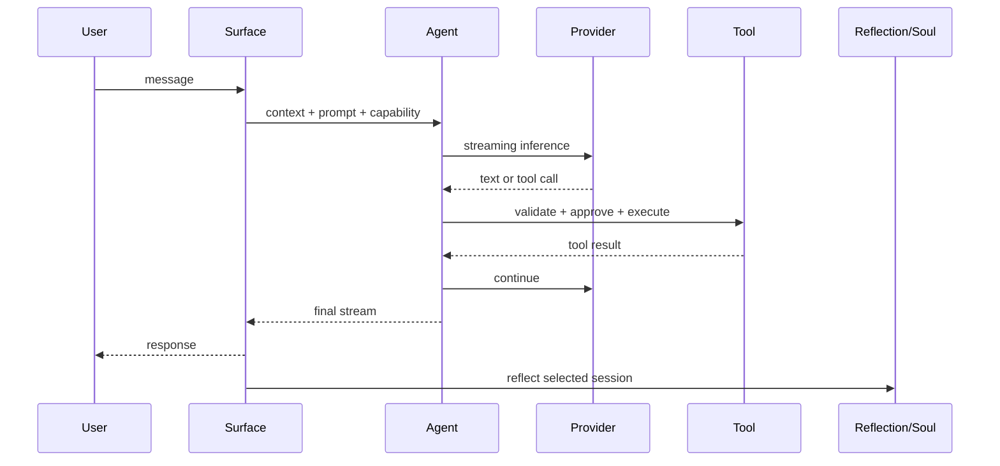
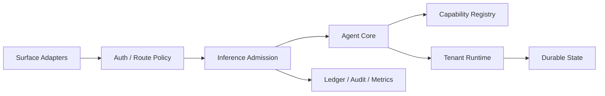

# LISA v0.21.0 全项目审查与优化建议

> 审查日期：2026-07-26<br>
> 基线提交：`237f1f036969ece484a60a0f6bc73552dd211883`<br>
> 审查范围：核心 Agent、CLI、Web/Cloud、Soul、知识库、自治、编排器、计费、macOS、iOS、官网、打包与 CI

## 1. 执行摘要

LISA 已经不是一个“带工具的聊天应用”，而是一个结构完整的个人 Agent 系统：

- 有统一的多模型 Agent 循环；
- 有可持续演进、可审计、可 Git 溯源的 Soul；
- 有知识摄取、检索和链接图；
- 有反思、心跳、空闲主动行为和 Cloud sweep；
- 有外部编码代理观察与调度；
- 有 CLI、Web、macOS、iOS 和 Cloud 多个产品表面；
- 有账户、额度、IAP 和全局消费控制；
- 有 1,384 个自动化测试，核心构建和原生客户端验证均通过。

整体判断是：**产品机制有辨识度，核心工程基础比通常的早期 Agent 项目扎实；当前主要矛盾已经从“功能是否完整”转为“本地强能力怎样安全地进入多租户 Cloud”。**

建议短期暂停继续横向扩张功能，安排一个稳定化里程碑，优先完成：

1. Cloud 能力隔离；
2. 认证链接与代理边界收紧；
3. 支付、额度与推理计量的一致性；
4. 多租户运行时与上下文生命周期；
5. HTTP 请求边界、自治幂等和跨端协议治理。

其中前三项应视为 P0。它们不是代码美观问题，而是上线 Cloud 后的权限、账户和资金正确性问题。

### 1.1 审查后的执行进展

审查结论已进入实现，并按安全域拆成草稿 PR：

| 推荐合并顺序 | PR | 结果 |
| --- | --- | --- |
| 1 | [#308 Cloud capability boundary](https://github.com/oratis/LISA/pull/308) | Cloud 服务端只注册 allowlist 工具，并拒绝本地 Agent/插件/MCP/技能执行入口 |
| 2 | [#309 Public origin and proxy boundary](https://github.com/oratis/LISA/pull/309) | 外部安全链接固定到配置 Origin，代理链按可信跳数解析 |
| 3 | [#311 Billing integrity](https://github.com/oratis/LISA/pull/311) | 账户与账务存储 fail-closed，IAP 使用可恢复状态机，外部交易幂等入账 |
| 4 | [#312 HTTP body limits](https://github.com/oratis/LISA/pull/312) | 24 个遗留入口全部有界；控制面 1 MiB、富媒体 20 MiB |
| 5 | [#314 Autonomy idempotency](https://github.com/oratis/LISA/pull/314) | 会话消息水位、pending/completed checkpoint、进程内互斥与 Firestore 租约 |
| 6 | [#315 Inference admission](https://github.com/oratis/LISA/pull/315) | Chat/Gateway 共用限流、租约、额度和 permit 生命周期 |
| 7 | [#316 TenantRuntime lifecycle](https://github.com/oratis/LISA/pull/316) | 单飞创建、请求 pin、TTL/LRU 和租户数量上限；Prompt 随 Runtime 回收 |

#316 以 #315 为基线，是唯一堆叠 PR；其余均直接以 `main` 为基线。下一轮仍需继续覆盖未统一准入的出生、语音润色、手动 Reflection，并把 Advisor、Idle/最近活动等进程级状态迁入 TenantRuntime。

## 2. 本次审查方法与证据

本次审查包括：

- 拉取 `origin/main` 最新代码，快进至 v0.21.0；
- 盘点所有跟踪目录、模块分布、入口和大文件；
- 阅读 CLI 组合根、Agent 循环、Web 路由、Soul、Reflection、知识库、自治、编排器、账户和计费实现；
- 追踪本地与 Cloud 的能力、状态、身份和推理调用路径；
- 检查 macOS、iOS、官网、打包与 CI；
- 运行 TypeScript 类型检查、完整测试、构建、原生客户端构建/测试和生产依赖审计。

本报告的行号基于上述提交。代码变化后应以符号和上下文重新定位。

## 3. 系统功能与机制总览

### 3.1 主要模块

| 模块 | 当前作用 | 评价 |
| --- | --- | --- |
| `src/agent.ts` | 流式模型调用、工具循环、审批、Hook、预算、终止 | 边界清楚，是可继续演进的核心 |
| `src/cli.ts` | 组合 Provider、工具、插件、MCP、会话、反思与 Web | 组合能力强，但本地与 Cloud 权限在此混合 |
| `src/prompt.ts` | 组合 Soul、技能、记忆与 KB | 产品理念一致，应补 Token/上下文治理 |
| `src/soul/` | 人格、日志、关系、情绪、观点、欲望、技能与溯源 | LISA 最具辨识度、也最成熟的部分之一 |
| `src/reflection.ts` | 从会话提取结构化长期变化 | 功能完整，需增强跨进程幂等 |
| `src/kb/` | 摄取、Wiki、Schema、搜索、链接和 Git | Local-first 思路连贯，需持续强化不可信输入边界 |
| `src/orchestrator/` | 观察、建议和调度外部 Agent | 差异化强，同时是高权限边界 |
| `src/web/server.ts` | UI、API、SSE、认证、计费、聊天、控制和调度 | 当前最大风险与维护热点 |
| `src/billing/` | 套餐、余额、IAP、消费上限 | 已有防护意识，但事务边界不完整 |
| `packaging/mac-client/` | macOS 壳、后端控制、Island | 构建通过，需清理并发和弃用警告 |
| `packaging/ios-client/` | SwiftUI、REST/SSE、Widget、IAP | 测试通过，协议仍靠手工同步 |
| `website/` | Astro 双语官网 | 构建稳定、相对独立 |

### 3.2 核心对话流



Agent 循环限制最多 32 轮工具迭代，并包含参数校验、审批、Hook、Token 预算、Prompt 热更新和异议约束。这一层已经具备成为全产品统一执行核心的条件。

### 3.3 Soul 与长期自我

Soul 不是单个“记忆文件”，而是身份、目的、宪法、价值观、情绪、观点、欲望、关系、日志、技能与记忆的组合。当前实现的优点包括：

- 动态 Lisa Home；
- 路径约束；
- 文件锁与原子写；
- 写入审计；
- Git 溯源；
- 格式错误重试；
- 对稀有/敏感 Soul 文档有额外约束。

建议保留这一结构，不要为了 Cloud 化把 Soul 简化成一张无版本的通用数据库表。Cloud 需要补的是 schema 版本、迁移、水位、幂等和租户隔离。

### 3.4 知识库

知识库由来源摄取、Wiki/Schema、TF-IDF 检索、链接图和 Git 版本组成。它适合本地个人知识工作，也符合“用户可检查、可迁移”的价值主张。

外部知识会进入 Prompt，因此必须继续坚持：

- 来源内容默认不可信；
- 数据与系统指令分离；
- 路径和协议白名单；
- 来源与变更可追溯；
- 网络抓取防 SSRF。

### 3.5 自治

当前有三种明显不同的自治信任级别：

- 系统自动 Heartbeat / Idle：受限工具；
- 用户编写的定时 Heartbeat：完整工具；
- Cloud sweep：扫描账户最近会话并反思。

设计方向正确，但“权限由调用路径隐含决定”的方式不够稳健。每次自治执行都应显式携带触发者、能力配置、预算、幂等键、会话水位和审计 ID。

### 3.6 外部 Agent 编排

编排器能观察 Claude、Codex、OpenCode、Aider、GitHub 等来源，并支持受管/PTY Agent、Advisor 和调度。这是 LISA 从个人聊天助手走向“个人 AI 操作层”的关键。

但它也是本地可信环境与 Cloud 多租户环境冲突最强的区域：工作目录、进程启动、Shell 和完整工具不能直接属于 Cloud 租户。

### 3.7 Web 与 Cloud

Web 服务目前同时负责 UI、HTTP/SSE、账户、认证、邮箱验证、计费、聊天、反思、Soul、计划、知识库、外部 Agent 和后台调度。`AsyncLocalStorage` 已经把多数文件路径切换到当前 UID，对 SSE 也做了租户过滤，这是良好基础。

问题在于：

- 服务端工具集合仍来自本地 CLI；
- 部分状态仍为进程级全局；
- 路由权限和请求限制分散在手写条件里；
- 推理计量没有覆盖所有路径；
- 一个 3,534 行文件承载过多安全域。

## 4. 质量验证结果

| 检查 | 结果 | 说明 |
| --- | --- | --- |
| TypeScript typecheck | 通过 | 严格类型配置生效 |
| Node 测试 | 1,383 通过、1 跳过、0 失败 | 共 1,384；跳过项需要真实 PTY |
| Node build | 通过 | 核心产物正常 |
| Website build | 通过 | 12 个静态页面 |
| macOS debug build | 通过并有警告 | Sendable 捕获、WKProcessPool 弃用 |
| iOS Simulator tests | 28 通过、0 失败 | iPhone 17 Pro 模拟器目标 |
| Production dependency audit | 未通过 | 5 high、6 moderate、1 low |

依赖漏洞涉及 `fast-uri`、`hono`、`protobufjs`、`undici`、`ws` 等，部分来自 MCP/Google SDK 传递依赖。不能机械执行 `npm audit fix --force`，因为审计建议中包含可能破坏兼容性的 MCP 版本变化；应在独立分支逐项升级、回归和发布。

## 5. 做得好的地方

### 5.1 安全意识已经进入代码，而非停留在文档

项目已有：

- 默认 loopback 与 Token gate；
- 常量时间 Token 比较；
- 路径穿越限制；
- Soul 原子写、锁、审计和 Git；
- 自动行为的受限工具集；
- KB 注入防护意识；
- SSE 租户过滤；
- 本地日消费上限在读取失败时 fail closed；
- 计量审计写入失败仍会扣账的保守策略。

这说明问题不是“团队没有安全意识”，而是产品从单用户本地扩展到多租户 Cloud 后，边界数量增加，原有局部防护尚未被统一成系统能力。

### 5.2 测试资产强

1,384 个测试覆盖 Provider、Agent、工具、Soul、知识库、计费和 Web 辅助模块。对于当前规模，这是重要资产。后续应尽量通过抽取可测路由和状态机来复用现有测试文化，而不是整体重写。

### 5.3 Local-first 不是口号

文件、Git、可检查的 Soul 和知识库让用户真正拥有数据。这是 LISA 与纯 SaaS 助手的根本差异，建议明确作为产品承诺保留。

### 5.4 Provider、工具和扩展层可组合

统一 Provider 抽象、工具注册、插件、技能、MCP 和 Hook 已经构成扩展平台。下一步不是增加更多扩展点，而是给这些扩展点加入明确的信任级别和 capability profile。

## 6. 风险与问题清单

## 6.1 P0：Cloud 继承完整本地工具能力

### 证据

- CLI 在 [`src/cli.ts`](../src/cli.ts#L446) 组合内建工具、技能、插件和 MCP，并在 [`src/cli.ts`](../src/cli.ts#L530) 把组合结果交给 Web 服务。
- Web 聊天在 [`src/web/server.ts`](../src/web/server.ts#L3381) 直接使用 `opts.tools`。
- [`src/tools/read.ts`](../src/tools/read.ts#L17)、[`src/tools/write.ts`](../src/tools/write.ts#L23) 接受绝对路径。
- [`src/tools/bash.ts`](../src/tools/bash.ts#L32) 在服务进程环境中执行 Shell。
- 受管 Agent 路由在 [`src/web/server.ts`](../src/web/server.ts#L2399) 接受工作目录并复用工具。

### 影响

在本地可信运行中，这是产品能力；在多租户 Cloud 中，它可能让普通账户读取宿主机文件、执行进程、访问环境变量、调用运营方插件/MCP，或把任意工作目录变成执行上下文。客户端 Edition 隐藏不能阻止直接 API 调用。

### 建议

建立服务端能力防火墙：

```ts
type CapabilityProfile =
  | "local-owner"
  | "local-autonomy"
  | "cloud-chat"
  | "cloud-autonomy"
  | "remote-device";
```

- `cloud-chat` 默认不包含 Shell、任意文件路径、宿主进程、运营方插件/MCP；
- 所有路由声明所需 profile；
- Cloud 工具运行在每租户隔离的沙箱或独立 Worker，而非 Web 进程；
- 审批只能在能力允许的集合内放行，审批不能升级能力；
- `/api/tools`、Agent 控制和本地配置类接口在 Cloud 服务端直接拒绝；
- 邮件 IMAP 主机和 Web fetch 进入统一出站策略。

### 验收

- Cloud 账户调用 Bash、绝对路径读写、受管 Agent、自定义 MCP 均返回服务端拒绝；
- 伪造 Edition、前端字段或审批结果不能绕过；
- 本地版原有能力和测试保持不变；
- 每次工具调用记录 profile、UID、请求 ID 和结果，不记录敏感正文。

## 6.2 P0：邮箱验证链接信任请求 Host

### 证据

[`src/web/server.ts`](../src/web/server.ts#L250) 的 `verifyLinkFor` 根据请求 `Host` 与 `x-forwarded-proto` 生成包含原始验证 Token 的 URL，并用于注册和重发邮件。

### 影响

如果生产代理没有严格重写这些头，攻击者可以构造恶意 Host，让邮件中的验证链接指向攻击者域名。用户点击后，URL 中的 Token 可能被攻击者收集。

### 建议

- 只从服务端配置 `LISA_PUBLIC_ORIGIN` 生成外部链接；
- 启动时校验它为允许的 HTTPS Origin；
- 禁止从请求头推导安全链接；
- 对生产边缘配置 Host allowlist；
- Token 使用一次性、短时、目的绑定设计；
- 增加恶意 Host、协议头与重放测试。

## 6.3 P0：客户端 IP 与限流代理边界不可靠

### 证据

[`src/web/server.ts`](../src/web/server.ts#L244) 直接取 `X-Forwarded-For` 第一项，代码注释也承认客户端可写入任意值。认证限流依赖该结果。

### 影响

在代理链未规范化时，攻击者可轮换伪造值绕过限流，也可能导致真实用户被错误归并。

### 建议

- 明确唯一可信边缘；
- 使用平台提供且由边缘覆盖的客户端 IP 头；
- 只在已知代理来源上解析 forwarded headers；
- 登录、注册和验证码同时按 IP、账户标识、设备/会话和全局速率限制；
- 将高风险认证限流前移到边缘。

## 6.4 P0：IAP 去重与余额入账不是原子操作

### 证据

- [`src/billing/iap.ts`](../src/billing/iap.ts#L277) 在交易索引损坏或不可读时返回空列表。
- [`src/billing/iap.ts`](../src/billing/iap.ts#L323) 先写入交易去重索引，之后才进行余额入账。
- Firestore 路径同样先创建交易文档，再独立修改余额。

### 两种失败

1. 去重索引损坏被当作空集合，同一外部交易可能再次入账。
2. 交易索引写成功、余额写失败后，重试会被判定为重复，用户永久收不到购买额度。

### 建议

使用一个权威事务完成：

- 验证外部交易；
- 以 `(provider, originalTransactionId)` 建立唯一键；
- 写入交易；
- 增加余额；
- 写入不可变账本；
- 返回相同幂等结果。

若存储无法跨对象事务，则使用 `received -> verified -> credited -> reconciled` 状态机、Outbox 和后台对账，绝不能用两个无恢复协议的顺序写。

## 6.5 P0：账户、余额和全局消费限制的错误语义不统一

### 证据

- [`src/web/accounts.ts`](../src/web/accounts.ts#L104) 把部分账户文件读取/解析错误视为空账户集合。
- [`src/billing/quota.ts`](../src/billing/quota.ts#L89) 把部分余额读取错误视为初始空余额。
- [`src/billing/limits.ts`](../src/billing/limits.ts#L201) 在 Firestore 读取失败且无缓存时可能以零消费继续，异步累计错误也可能被吞掉。

### 影响

账户或余额文件损坏后，下一次变更可能覆盖原数据；消费上限在后端异常时可能 fail open。

### 建议

统一存储错误模型：

- 只有明确 `ENOENT` / document-not-found 才能初始化；
- 解析错误、权限错误、超时和服务异常全部停止写入并报警；
- 认证与账务状态保留备份、版本和恢复工具；
- 花费上限使用权威的原子“预算预留”，失败时拒绝新增消费；
- 增加存储损坏、超时、并发和恢复测试。

## 6.6 P0：不是所有模型调用都经过统一计量

聊天有额度和计量路径，但手动反思接口 [`src/web/server.ts`](../src/web/server.ts#L3512)、出生流程、语音润色和后台自治等路径没有全部经过同一个推理准入层。

### 影响

- 用户可绕过聊天额度消耗模型；
- 全局成本上限不准确；
- 失败、重试和后台任务难以核算；
- 后续 Provider 切换会继续复制计费逻辑。

### 建议

建立单一 `InferenceAdmissionGateway`：

1. 身份与运行 profile；
2. 用户额度与全局预算预留；
3. 并发租约；
4. Provider 调用；
5. 实际 Token/费用结算；
6. 失败补偿；
7. 审计和指标。

聊天、反思、出生、语音、自治和后台任务都必须调用它。

## 6.7 P1：租户运行时缓存无生命周期

### 证据

[`src/web/server.ts`](../src/web/server.ts#L397) 的 `uidChats` 和 `promptCache` 是无界 Map。每个用户的会话可载入大量消息，除删除账户外没有 TTL/LRU。

### 影响

Cloud 实例的内存随活跃租户和长会话增长，最终造成 GC 压力或 OOM。

### 建议

引入显式 `TenantRuntime`：

- 每租户上下文、Prompt、最近活动和 Advisor 状态；
- TTL + LRU + 总字节/Token 上限；
- 空闲时持久化并卸载；
- 请求中只分页加载所需历史；
- 指标记录命中率、租户数、估算内存和淘汰次数。

## 6.8 P1：Web 长会话没有 Context 压缩

CLI 有 compaction 概念，但 Web 选项没有完整传递，聊天路径会继续使用完整历史。

### 影响

长会话最终触达模型上下文上限，同时增加延迟、费用和进程内存。

### 建议

- 用 Token 而不是消息条数管理窗口；
- 保留最近原文 + 结构化摘要 checkpoint；
- 对工具结果做尺寸限制和持久引用；
- 摘要带来源消息水位与版本；
- 用户可开启新会话但继承 Soul/长期记忆；
- 对压缩质量、事实保留和成本建立回归集。

## 6.9 P1：部分租户状态仍为进程级全局

最近用户消息时间、部分历史、Idle 消息、Advisor 建议和 Screen 配置仍存在全局变量。Island ping 在 [`src/web/server.ts`](../src/web/server.ts#L1811) 读取当前用户欲望，却结合全局最近活动与历史；Advisor latest 在 [`src/web/server.ts`](../src/web/server.ts#L2009) 返回全局结果。

另有计划选择接口在 [`src/web/server.ts`](../src/web/server.ts#L3028) 修改进程级配置。Cloud 端不能只依赖客户端隐藏这些接口。

### 建议

- 所有可变运行状态进入 `TenantRuntime`、系统级 `OperatorRuntime` 或不可变配置，三者不可混用；
- 每个路由声明状态作用域；
- Cloud 禁止租户修改进程级配置；
- 添加两个 UID 并发交错的隔离测试。

## 6.10 P1：Cloud Reflection 缺幂等水位与分布式租约

[`src/web/autonomy-sweep.ts`](../src/web/autonomy-sweep.ts#L120) 主要按时间戳判断，会对最近会话重复反思，而不是记录已处理的最后消息。多实例或调度重叠时也缺少每用户分布式 claim。

### 影响

- 未变化的会话重复花费 Token；
- 日志、记忆、观点和欲望重复写入；
- 多实例并发导致重复操作；
- 固定顺序加运行上限可能让后面的用户长期饥饿。

### 建议

- checkpoint：`sessionId + lastMessageId/hash + reflectionVersion`；
- 每次反思生成幂等键；
- 对 Soul operation 去重；
- 使用有 TTL 的分布式租约；
- 维护公平游标或队列；
- 无新消息直接跳过；
- 对重复调度、实例崩溃和恢复做测试。

## 6.11 P1：大量 HTTP 路由无请求体上限

认证/计费部分已有集中 body parser，但聊天、文件、语音、计划、代理控制等大量路由仍手工：

```ts
for await (const chunk of req) body += chunk;
```

聊天还接受 base64 文件。认证用户可以发送超大请求拖垮进程。

### 建议

建立统一路由层：

- 默认 JSON 上限；
- 聊天文本、附件、音频各自上限；
- 流式上传或对象存储直传；
- Content-Type 检查；
- body/header/request timeout；
- 慢速上传防护；
- 统一错误格式；
- 超限与中断测试。

## 6.12 P1：Web 服务器过度集中

`src/web/server.ts` 约 3,534 行，手工路由串联认证、计费、UI、聊天、Soul、Agent 控制和调度。

这不是“行数一大就错误”，但安全规则难以集中验证，同一逻辑容易在新路由中遗漏。

### 建议

先做无行为变化的模块化拆分：

```text
web/
  app.ts
  router.ts
  middleware/
    auth.ts
    body-limit.ts
    capability.ts
    quota.ts
  routes/
    auth.ts
    billing.ts
    chat.ts
    soul.ts
    agents.ts
    system.ts
```

不建议此时为了“现代化”整体换框架。先把路由元数据、中间件、错误模型和测试边界建立起来。

## 6.13 P1：Web Fetch 的 SSRF 防护只做字面检查

[`src/tools/web_fetch.ts`](../src/tools/web_fetch.ts) 会阻止明显的私有主机/IP，但没有在连接前解析并锁定 DNS 结果。攻击者控制的域名可解析到私网，或在校验后发生 DNS rebinding。

### 建议

- 解析全部 A/AAAA；
- 阻断私有、环回、链路本地、保留、元数据地址和 IPv4-mapped IPv6；
- 连接时 pin 已验证地址；
- 每次重定向重新验证；
- Cloud 使用网络层出站 allow/deny；
- 同样治理 IMAP 和未来所有 URL 工具。

## 6.14 P1：CLI 选项在 Web 模式语义不完整

`--no-reflect`、`--compact`、`--approval` 等选项在 CLI 有帮助文本或解析逻辑，但 Web 运行路径没有完整消费。特别是 Web 的定时 Reflection 未真正受 `opts.reflect` 控制。

### 建议

用类型化的 surface config 代替散落布尔值：

```ts
interface RuntimePolicy {
  surface: "cli" | "local-web" | "cloud";
  reflection: "off" | "manual" | "scheduled";
  compaction: ContextPolicy;
  approval: ApprovalPolicy;
  capabilities: CapabilityProfile;
}
```

为每种 surface 建快照测试，验证配置确实影响运行行为。

## 6.15 P1：跨端 API 协议靠手工同步

Swift 模型以注释说明“镜像 TypeScript 类型”，但没有统一 OpenAPI/JSON Schema 来源。服务端、macOS 和 iOS 很容易渐进漂移。

### 建议

- 为外部 API 建可版本化 schema；
- CI 验证服务端响应符合 schema；
- 生成 Swift DTO 或至少生成 contract fixtures；
- Swift 保留 tolerant decoding，生成代码不应牺牲向前兼容；
- SSE 事件也纳入版本化协议。

## 6.16 P1：PR CI 没覆盖全部产品表面

主 CI 只执行顶层 Node typecheck/test/build。Website、macOS、iOS 主要在发布工作流中验证。

### 建议

- PR path filter：
  - Node 核心：typecheck/test/build；
  - website：Astro build；
  - macOS：Swift debug build；
  - iOS：Simulator tests；
  - packaging：最小 smoke；
- 成本较高的原生全矩阵可每日运行，但 PR 至少做受影响目标；
- 增加依赖审计、SBOM 和 Dependabot/Renovate；
- 设定覆盖率趋势与关键安全模块阈值。

## 6.17 P2：原生客户端警告与协议演进

macOS 构建通过，但存在：

- `BackendController.swift` 中 Sendable closure 捕获后修改 observer；
- `IslandContent.swift` 和 `WebContent.swift` 使用已弃用 `WKProcessPool`。

建议在 Swift 6 更严格并发检查前解决，并把原生客户端构建变成日常质量门。

## 6.18 P2：前端以大段 TS 字符串维护

Web HTML、CSS 和客户端逻辑集中在较大的 TypeScript 文件中。这保留了零额外运行时和简单打包的优点，但样式、可访问性、协议与组件复用会越来越难。

建议先抽静态资产和协议客户端，再评估是否引入轻量构建系统；不建议直接进行完整框架重写。

## 7. 建议目标架构

### 7.1 两个明确的产品配置

#### Lisa Local

- 用户拥有进程、文件与模型凭据；
- 允许完整工具、插件、MCP 和编排器；
- 数据以文件/Git 为主；
- 审批与自治由用户配置；
- Cloud 可选地只做同步或中继。

#### Lisa Cloud

- 默认是有边界的对话与长期人格服务；
- 不访问 Web 宿主机文件或 Shell；
- 所有工具来自 Cloud allowlist，并在租户沙箱执行；
- 账户、余额、交易、租约使用事务存储；
- 所有推理走统一准入、计量和审计；
- 若需要控制用户本地 Mac，应通过设备身份、短时 capability token 和本地执行代理，而不是在 Cloud 宿主机执行。

### 7.2 保持模块化单体

近期目标：



先让边界在同一仓库内清晰可测。只有当独立扩缩容、故障域或团队所有权形成真实需求时，再拆推理、沙箱或后台任务服务。

### 7.3 统一三个横切面

1. **RuntimePolicy**：Surface、Capability、Approval、Reflection、Compaction。
2. **InferenceAdmissionGateway**：认证、额度、并发、成本、结算和审计。
3. **TenantRuntime**：租户缓存、最近活动、上下文、Advisor、TTL/LRU 和持久化。

这三个抽象会同时消除多处当前风险，而不是逐路由打补丁。

## 8. 分阶段优化路线图

## 阶段 0：立即止血，1–3 天

- Cloud 服务端禁用 Bash、任意文件读写、受管 Agent、运营方插件/MCP 和进程级配置接口；
- 设置并强制 `LISA_PUBLIC_ORIGIN`；
- 修复可信代理 IP 解析；
- 给所有大 body 路由加保守上限；
- 暂时限制或关闭未计量的 Cloud 手动反思；
- 为支付和余额损坏场景改为 fail closed；
- 对高风险接口增加审计告警。

交付标准：可证明 Cloud 普通账户无法触达宿主能力，验证链接不依赖请求头，存储异常不会继续计费或覆盖账务。

## 阶段 1：稳定化版本，约 2 周

- 实现 Capability Profile 与路由能力中间件；
- 实现统一推理准入和计量；
- 把 IAP 改造成事务账本或可恢复状态机；
- 抽出 TenantRuntime，加入 TTL/LRU；
- 实现 Web context compaction；
- Reflection 加消息水位、幂等键和租约；
- 拆分 Web 路由模块并增加 body/auth/capability 集成测试；
- 清理已知生产依赖高危漏洞。

交付标准：关键不变量有自动化拒绝路径、失败注入和并发测试。

## 阶段 2：平台化，约 4–6 周

- 建 API schema 和 Swift contract 生成/验证；
- 建 Cloud 工具沙箱和出站网络策略；
- 建支付对账器、后台任务队列与公平调度；
- 加结构化日志、指标、Trace 和 SLO；
- 做账户/Soul schema 版本与迁移框架；
- 扩大 PR CI 到 website/macOS/iOS/packaging；
- 抽离 Web 静态资产和前端协议层。

## 阶段 3：增长与差异化

- 设备能力代理：Cloud 安全请求用户本地 LISA 执行；
- 可解释的 Soul 变更时间线和撤销；
- 自治预算、可视化和用户策略；
- Agent 编排器的能力委托图；
- 本地/Cloud 加密同步与冲突处理；
- 基于真实指标再决定服务拆分和前端框架。

## 9. 正反方辩论

## 辩题一：Local 与 Cloud 是否继续共用一套代码

### 正方：继续共用

- Agent、Soul、KB、Provider 和协议逻辑高度重合；
- 单仓库减少行为漂移；
- 测试和发布流程更集中；
- 小团队维护两个实现会显著降低功能速度。

### 反方：应该拆开

- 本地的完整 Shell/文件权限与 Cloud 的最小权限目标相反；
- 环境变量和配置组合容易让 Cloud 意外继承本地能力；
- 一个条件分支遗漏就可能变成跨租户安全问题；
- 部署和故障域不同。

### 结论

**共用核心代码，分离运行入口、能力配置和部署产物。** 不应复制 Agent/Soul，但 Cloud 不能直接调用 Local 组合根。构建时生成明确的 `lisa-local` 与 `lisa-cloud` entrypoint，并用测试证明 Cloud 产物不注册本地高权限工具。

## 辩题二：模块化单体还是立即微服务化

### 正方：微服务

- 推理、计费、沙箱和后台任务的安全/扩缩容需求不同；
- 故障隔离更强；
- 交易服务可以获得独立事务边界。

### 反方：模块化单体

- 当前问题主要是边界不清，而不是单进程本身；
- 微服务会立即引入网络失败、分布式事务和运维成本；
- 团队需要先有稳定协议与可观测性，否则只是把耦合搬到网络上；
- 现有测试和本地开发体验会受到冲击。

### 结论

**先模块化单体。** 将能力、计费、TenantRuntime、路由和后台任务抽成清晰模块；Cloud 工具沙箱可优先独立进程/服务。其余服务拆分以可测的容量或故障域数据为依据。

## 辩题三：Cloud 是否应该提供完整工具

### 正方：应该

- 完整工具是 Agent 价值的核心；
- 功能一致有利于用户理解；
- 审批机制可以把风险交给用户决策。

### 反方：不应该

- Cloud 用户无法对宿主机资源拥有合法、清晰的授权；
- “用户点了批准”不等于可以读取运营方文件或环境变量；
- 插件/MCP 可能持有运营方凭据；
- 多租户隔离失败的影响远大于单机误操作。

### 结论

**Cloud 提供受限、隔离、可审计的工具，不提供宿主机完整工具。** 用户本地能力通过设备代理执行；审批是 capability 范围内的二次确认，不是提权机制。

## 辩题四：手写 Node HTTP 还是迁移框架

### 正方：保留手写 HTTP

- 依赖少、启动快、行为透明；
- 当前服务已经运行且测试广；
- 框架迁移本身不能自动解决权限和计费问题。

### 反方：采用框架/Router

- 中间件、Body limit、错误处理和路由元数据更标准；
- 3,500 行条件链难以审计；
- 更容易进行 handler 级集成测试。

### 结论

**近期不整体换框架，但必须建立 Router 与集中中间件。** 可以继续用 Node HTTP 或引入极小 Router；选择标准是类型、限制、测试和可观测性，不是框架流行度。

## 辩题五：Web UI 是否应该重写为现代前端框架

### 正方：重写

- 组件、状态、可访问性和测试工具成熟；
- 当前大段字符串 CSS/JS 难维护；
- 多表面复用可能更容易。

### 反方：渐进抽取

- 全量重写风险高，短期没有解决 P0；
- 新工具链增加包体、构建和依赖治理；
- 当前 UI 已可用，官网也已有独立 Astro 栈；
- 原生壳主要嵌入现有 Web 内容。

### 结论

**先抽静态资产、API client、状态边界和组件测试，再决定框架。** 如果后续 UI 复杂度继续增长，可迁移到轻量组件方案，但不应把稳定化窗口花在视觉层重写上。

## 辩题六：Cloud 状态统一放 Firestore，还是继续文件/GCS

### 正方：统一数据库

- 事务、查询、唯一约束和并发控制更适合账户与计费；
- 迁移和监控更集中；
- 多实例一致性更清楚。

### 反方：保留文件/对象

- Soul 和 KB 天然是文档/文件；
- Local 与 Cloud 格式一致便于迁移；
- Git 历史有可解释性；
- 把所有人格内容拆成数据库行会损害可拥有性。

### 结论

**分域存储。** 账户、认证、余额、交易、租约和任务索引用事务数据库；Soul/KB 文档可使用版本化对象存储或文件格式。两类存储通过 ID 和版本关联，不做伪原子双写。

## 辩题七：Reflection/自治应该默认开启吗

### 正方：默认开启

- 持续人格是 LISA 的产品核心；
- 不反思就退化成普通聊天；
- 主动性需要后台机制。

### 反方：默认关闭或强限制

- 会产生不可见成本和意外人格变化；
- 重复反思会污染 Soul；
- Cloud 后台行为涉及用户知情、隐私和预算；
- 错误自动化比一次聊天错误影响更持久。

### 结论

**Local 可默认开启并允许用户完全控制；Cloud 应显式展示、可暂停、受预算和幂等水位约束。** 每次变更可解释、可撤销，后台成本可见。

## 辩题八：跨端协议使用 Codegen 还是手写容错模型

### 正方：Codegen

- 降低 TypeScript/Swift 漂移；
- API 变更在 CI 即可发现；
- 文档和测试可从同一 Schema 生成。

### 反方：手写

- 生成模型可能僵硬、噪音大；
- Swift 客户端需要兼容旧服务和缺字段；
- SSE 与动态 Agent 内容不总适合强类型。

### 结论

**Schema 作为事实源，生成或验证 DTO，同时保留容错解码。** Codegen 负责一致性，不负责取消版本兼容策略。

## 辩题九：继续功能速度，还是先做稳定化

### 正方：继续功能

- 产品仍在快速寻找市场；
- 用户感知的是能力而非内部整洁；
- 大规模基础设施工作可能延缓反馈。

### 反方：稳定化

- 当前 P0 涉及宿主权限、验证 Token 和资金；
- 功能越多，未统一边界的修复成本越高；
- Cloud 一旦产生真实数据，迁移和事故成本陡增；
- 现有功能已经足够支撑用户验证。

### 结论

**安排 2 周左右稳定化里程碑，并保留少量用户直接阻塞的功能修复。** 稳定化不是无限重构，以 P0/P1 验收项完成为结束条件。

## 10. 可观测性与验收指标

建议建立以下不含敏感正文的指标：

### 安全

- Cloud 高权限工具拒绝次数；
- SSRF/私网目的地址拦截；
- 认证限流命中与验证码重放；
- 跨租户隔离测试通过率；
- 未标注 capability 的路由数量必须为 0。

### 计费

- 推理请求与账本记录匹配率 100%；
- IAP `verified-but-not-credited` 数量；
- 对账差异数量与最长恢复时间；
- 全局预算预留失败时新增推理为 0；
- 后台推理成本按触发类型可分解。

### 运行

- TenantRuntime 活跃数、估算内存、淘汰数；
- P50/P95 首 Token 延迟和完整响应时间；
- Context 压缩率与摘要回归分数；
- Sweep 排队时间、重复跳过率、租约冲突；
- SSE 断线和重连率。

### 质量

- Node、Web、macOS、iOS、官网 PR 门通过率；
- 生产依赖 high/critical 漏洞数量；
- P0/P1 模块覆盖率与失败注入用例数；
- API schema 不兼容变更数量。

## 11. 不建议现在做的事

- 不建议整体重写 Agent 核心；
- 不建议立即拆成大量微服务；
- 不建议为追求“统一”把 Local Soul 全部数据库化；
- 不建议只通过 UI 隐藏来修 Cloud 权限；
- 不建议用 `npm audit fix --force` 无回归升级；
- 不建议把稳定化窗口投入前端框架重写；
- 不建议依靠用户审批为 Cloud 宿主能力授权；
- 不建议在计费链路继续增加非事务双写。

## 12. 最终结论

LISA 的核心价值已经成立：它把长期自我、知识、工具、自治和外部 Agent 协同连成了一个连贯系统。下一阶段的优秀工程决策不是再加一层能力，而是把“谁、在什么表面、以什么预算、能调用什么、状态属于谁、失败后如何恢复”变成系统的一等概念。

优先顺序应是：

1. Cloud 能力与宿主彻底隔离；
2. 认证和代理边界固定；
3. 交易、余额、额度和所有推理调用统一进入可恢复账本；
4. TenantRuntime、Context 和 Reflection 建立生命周期与幂等；
5. Web 模块化、请求限制、协议 Schema 和跨端 CI；
6. 在上述基础上继续扩展自治、设备代理和编排能力。

完成这些工作后，LISA 会从“功能丰富且工程质量不错的个人 Agent”迈入“可以安全承载多用户、长期状态与真实支付的 Agent 平台”。
